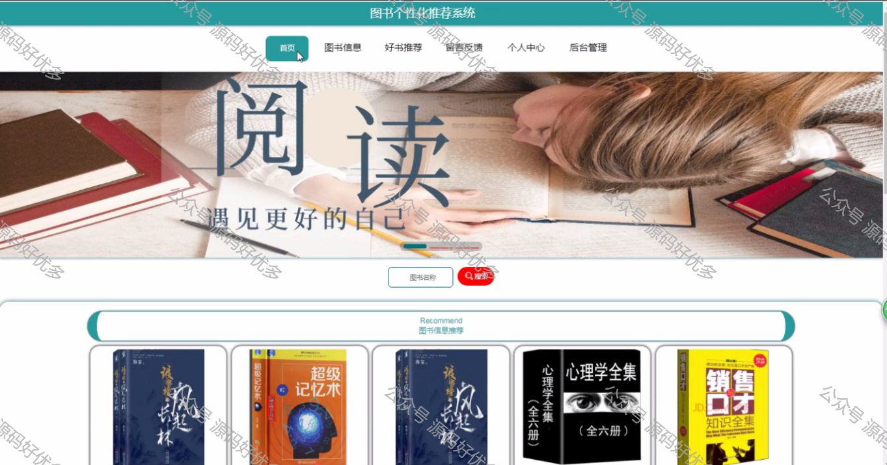
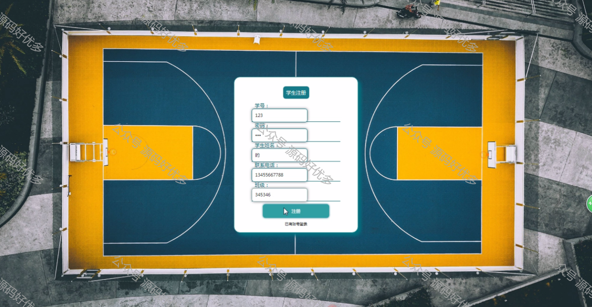
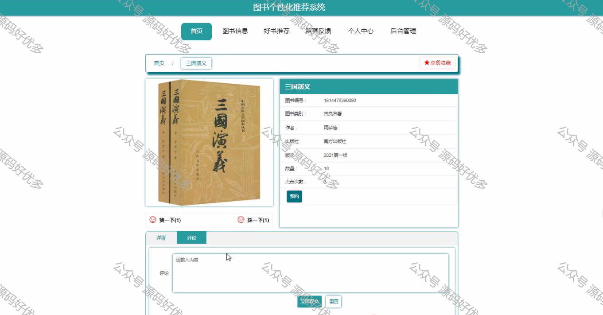
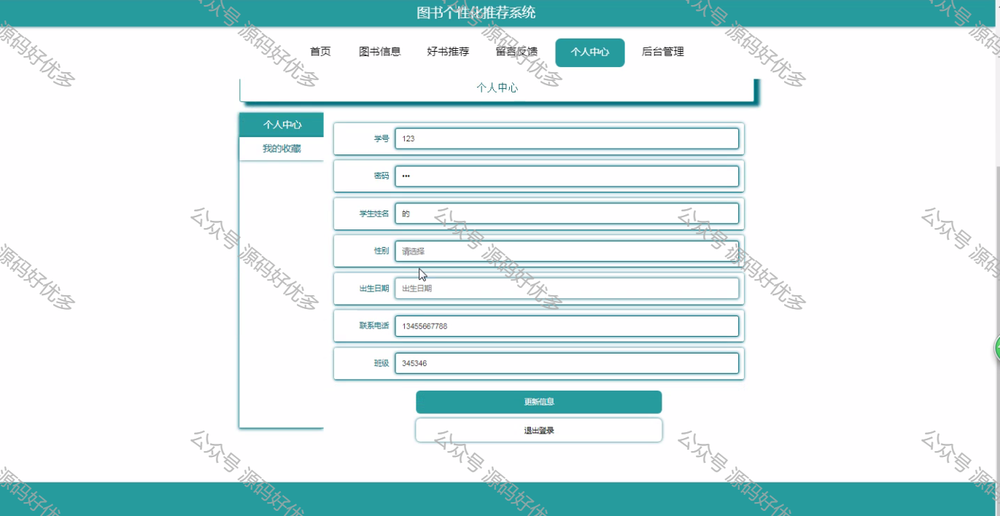
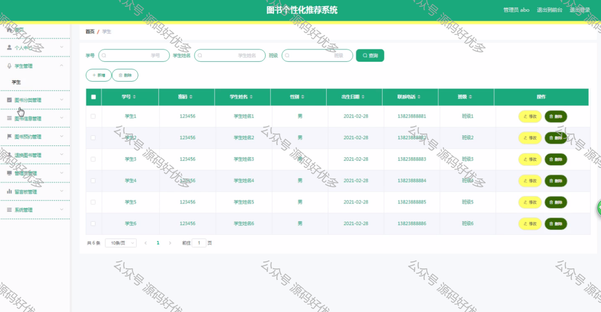
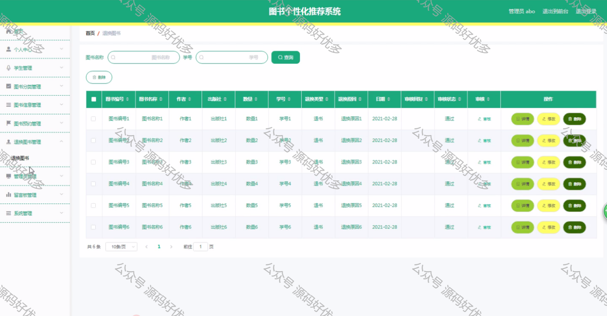
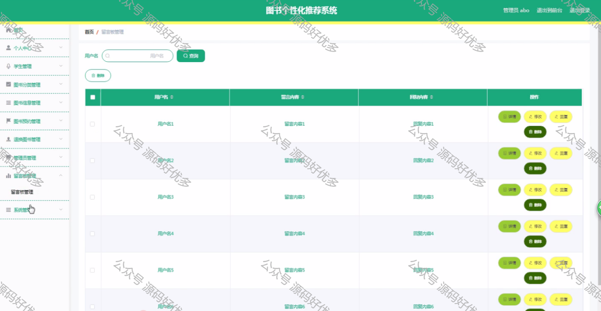
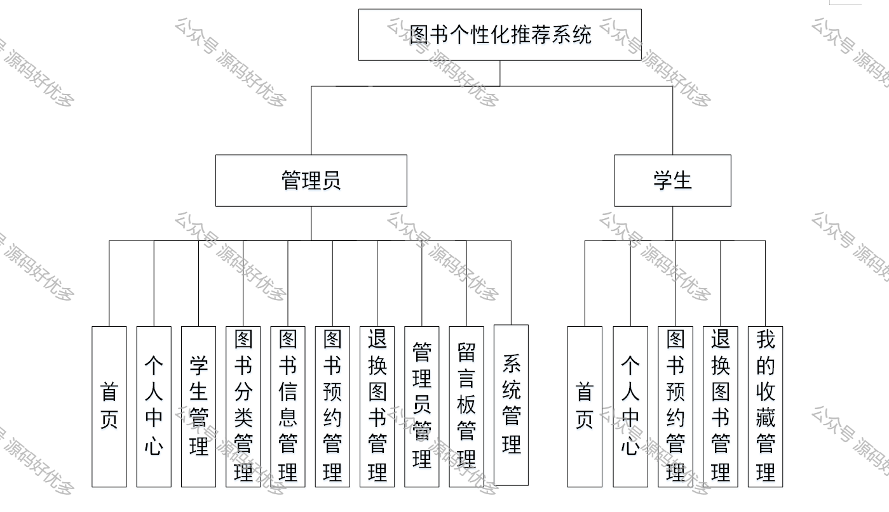

 

> **作者介绍**： **✌**全网粉丝10W+本平台特邀作者、博客专家、CSDN新星计划导师、java领域优质创作者,博客之星、掘金/华为云/阿里云/InfoQ等平台优质作者、专注于毕业项目实战 **✌**

  

### 一、作品包含

源码+数据库+设计文档万字LW+PPT+全套环境和工具资源+部署教程

### 二、项目技术

前端技术：Html、Css、Js、Vue、Element-ui

数据库：MySQL

后端技术：Java、Spring Boot、MyBatis

  

### 三、运行环境

开发工具：IDEA/eclipse

数据库：MySQL8.0

数据库管理工具：Navicat10以上版本

环境配置软件： JDK1.8+Maven3.6.3

前端Nodejs：14

  

### 四、项目介绍

项目编号：springboot003

图书个性化推荐系统的主要使用者分为管理员和学生，实现功能包括管理员：首页、个人中心、学生管理、图书分类管理、图书信息管理、图书预约管理、退换图书管理、管理员管理、留言板管理、系统管理，学生：首页、个人中心、图书预约管理、退换图书管理、我的收藏管理，前台首页；首页、图书信息、好书推荐、留言反馈、个人中心、后台管理等功能。由于本系统的功能模块设计比较全面，所以使得整个图书个性化推荐系统信息管理的过程得以实现。
本系统的使用可以实现本图书个性化推荐系统管理的信息化，可以方便管理员进行更加方便快捷的管理，可以提高管理人员的工作效率。

### 五、运行截图

  
